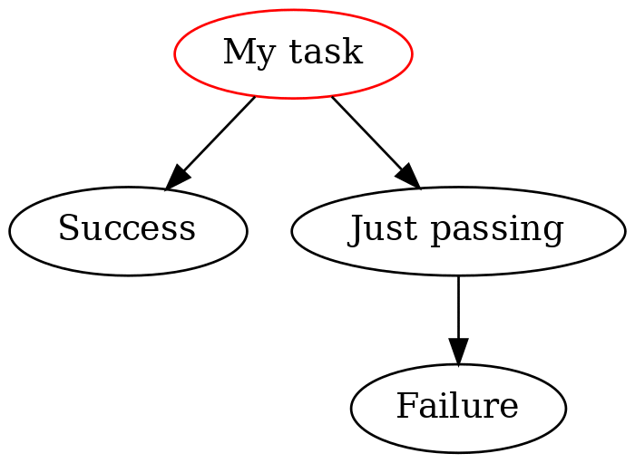

# AWS Step Functions SDK

[](https://github.com/suzil/awsstepfuncs/releases/latest)
[](https://github.com/python/black)
[](https://github.com/suzil/awsstepfuncs/actions)
[](https://github.com/pre-commit/pre-commit)
[](http://mypy-lang.org/)
[](https://codecov.io/gh/suzil/awsstepfuncs)
[](https://awsstepfuncs.readthedocs.io/en/latest/?badge=latest)

⚠️ **WARNING: This project is still a work-in-progress.** ⚠️

The Python SDK `awsstepfuncs` can compile to [Amazon States Machine](https://states-language.net/) to use in a real AWS Step Functions application and can run simulations with mocked functions to debug state machines.

```py
resource = "arn:aws:lambda:ap-southeast-2:710187714096:function:DummyResource"
task_state = TaskState("My task", resource=resource)
succeed_state = SucceedState("Success")
pass_state = PassState("Just passing")
fail_state = FailState("Failure", error="IFailed", cause="I failed!")

task_state >> succeed_state
pass_state >> fail_state
task_state.add_catcher(["States.ALL"], next_state=pass_state)

state_machine = StateMachine(start_state=task_state)

def failure_mock_fn(event, context):
    assert False

state_machine.simulate(
    resource_to_mock_fn={resource: failure_mock_fn}, show_visualization=True
)
```

<p align="center">
  
</p>


## Installation

~~This package is available on PyPI:~~

```sh
$ pip install awsstepfuncs
```

To create visualizations, you need to have [GraphViz](https://graphviz.org/) installed on your system.


## Usage

Everything you need in this library can be imported like so:

```py
from awsstepfuncs import *
```

Now you can define some [states](https://states-language.net/#states-fieldshttps://docs.aws.amazon.com/step-functions/latest/dg/concepts-states.html).

```py
pass_state = PassState(
    "My Pass", comment="Passes its input to its output without performing work"
)
times_two_resource = "arn:aws:lambda:ap-southeast-2:710187714096:function:TimesTwo"
task_state = TaskState(
    "My Task",
    comment="Times two task",
    resource=times_two_resource,
)
```

Next, define how the states should transition to one another. You can use the `>>` operator to declare that one state transitions to another state.

```py
pass_state >> task_state
```

Now you can define the state machine by declaring the starting state.

```py
state_machine = StateMachine(start_state=pass_state)
```

There are two complementary use cases for using `awsstepfuncs`.


### Compiling to Amazon States Language

The first use case is to compile the state machine to [Amazon States Language](https://docs.aws.amazon.com/step-functions/latest/dg/concepts-amazon-states-language.html) to a JSON output that can be for a real AWS Step Functions application.

```py
state_machine.to_json("state_machine.json")
```

```json
{
    "StartAt": "My Pass",
    "States": {
        "My Pass": {
            "Type": "Pass",
            "Comment": "Passes its input to its output without performing work",
            "Next": "My Task"
        },
        "My Task": {
            "Type": "Task",
            "Comment": "Times two task",
            "End": true,
            "Resource": "arn:aws:lambda:ap-southeast-2:710187714096:function:TimesTwo"
        }
    }
}
```


### Simulation

The second use case is to simulate the state machine by defining mock functions for any resource and passing in some input data. The simulation of the state machine allows you to easily debug what's going on and if your state machine works as expected.

```py
def mock_times_two(event, context):
    event["foo"] *= 2
    return event

state_output = state_machine.simulate(
    {"foo": 5, "bar": 1},
    resource_to_mock_fn={
        times_two_resource: mock_times_two,
    },
)

assert state_output == {"foo": 10, "bar": 1}
```

```
Starting simulation of state machine
Executing PassState('My Pass')
State input: {'foo': 5, 'bar': 1}
State input after applying input path of $: {'foo': 5, 'bar': 1}
Output from applying result path of $: {'foo': 5, 'bar': 1}
State output after applying output path of $: {'foo': 5, 'bar': 1}
State output: {'foo': 5, 'bar': 1}
Executing TaskState('My Task')
State input: {'foo': 5, 'bar': 1}
State input after applying input path of $: {'foo': 5, 'bar': 1}
Output from applying result path of $: {'foo': 10, 'bar': 1}
State output after applying output path of $: {'foo': 10, 'bar': 1}
State output: {'foo': 10, 'bar': 1}
Terminating simulation of state machine
```

As you can see from the standard output, each state is executed and data flows between the states ending with some final state output.


## API coverage


### States compilation and simulation

| State        | Compile Coverage                                                                                            | Simulation Coverage                                                                                         |
| ------------ | ----------------------------------------------------------------------------------------------------------- | ----------------------------------------------------------------------------------------------------------- |
| **Fail**     | :heavy_check_mark:                                                                                          | :heavy_multiplication_x: Missing error handling                                                             |
| **Succeed**  | :heavy_check_mark:                                                                                          | :heavy_check_mark:                                                                                          |
| **Choice**   | :heavy_multiplication_x:                                                                                    | :heavy_multiplication_x:                                                                                    |
| **Wait**     | :heavy_check_mark:                                                                                          | :heavy_check_mark:                                                                                          |
| **Pass**     | :heavy_check_mark:                                                                                          | :heavy_check_mark:                                                                                          |
| **Map**      | :heavy_check_mark:                                                                                          | :heavy_check_mark:                                                                                          |
| **Parallel** | :heavy_multiplication_x:                                                                                    | :heavy_multiplication_x:                                                                                    |
| **Task**     | :heavy_multiplication_x: Missing TimeoutSeconds, TimeoutSecondsPath, HeartbeatSeconds, HeartbeatSecondsPath | :heavy_multiplication_x: Missing TimeoutSeconds, TimeoutSecondsPath, HeartbeatSeconds, HeartbeatSecondsPath |


### Input and output processing

| Field              | Support                  |
| ------------------ | ------------------------ |
| **InputPath**      | :heavy_check_mark:       |
| **OutputPath**     | :heavy_check_mark:       |
| **Parameters**     | :heavy_multiplication_x: |
| **ResultSelector** | :heavy_check_mark:       |
| **ResultPath**     | :heavy_check_mark:       |


### Errors

All errors are supported for compilation, but only a subset can be simulated. For a description of error codes, check out [this table](https://states-language.net/spec.html#appendix-a).

| Error code                        | Simulation Support                      |
| --------------------------------- | --------------------------------------- |
| **States.ALL**                    | :heavy_check_mark:                      |
| **States.Timeout**                | :heavy_multiplication_x: (planned)      |
| **States.TaskFailed**             | :heavy_multiplication_x: (planned)      |
| **States.Permissions**            | :heavy_multiplication_x: (not possible) |
| **States.ResultPathMatchFailure** | :heavy_multiplication_x: (planned)      |
| **States.ParameterPathFailure**   | :heavy_multiplication_x: (planned)      |
| **States.BranchFailed**           | :heavy_multiplication_x: (planned)      |
| **States.NoChoiceMatched**        | :heavy_multiplication_x: (planned)      |
| **States.IntrinsicFailure**       | :heavy_multiplication_x: (not sure yet) |


### Extra fields

Currently lacking support for Context Objects, Payload Templates, and Parameters. When reporting coverage for states above, these fields are ignored.


## Development

Create a virtual environment:

```sh
$ python -m venv .venv
$ source .venv/bin/activate
```

Install all dependencies:

```sh
$ make install
```

Run lint with:

```sh
$ make lint
```

Run tests with:

```sh
$ make test
```
